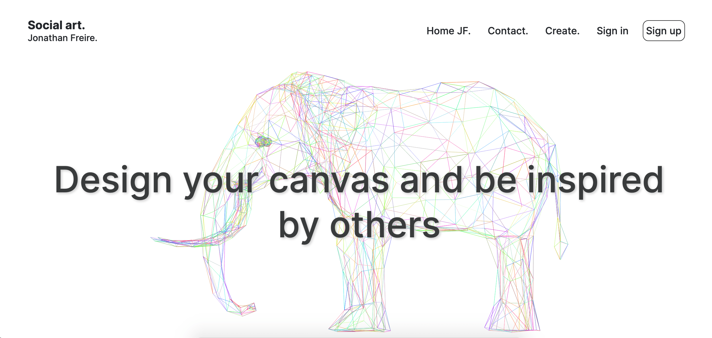

<h2 align="center">
  Social art - Jonathan Freire 
  <a href="https://socialart.jonathanfreire.com/" target="_blank">socialart.jonathanfreire.com</a>
</h2>

  

 

 &nbsp;
 &nbsp;
 &nbsp;

## TL;DR

You can fork this repo to modify and make changes of your own. I hope you enjoy it.

## Built With

Social Art is a social network that allows you to draw and show your creativity. You also can edit or delete them and give likes to works that you like the most.

This project was built using these technologies.

- React.js
- Node.js
- Next.js
- SWR
- NextAuth.js
- mongoose
- react-canvas-draw
- react-colorful
- Lz-string
- crypto
- uuid
- Sass
- react-cookie-consent
- VsCode
- Vercel

## Features

**🎨 Styled with SCSS**

**📱 Fully Responsive**

**🛡 Authentication with NextAuth**

## Getting Started

Clone down this repository. You will need `node.js` and `git` installed globally on your machine.

## 🛠 Installation and Setup Instructions

1. Installation: `npm install`
2. You have to create a .env.development file in the parameters: `MONGODB_URI`,`SECRET` and `JWT_SIGNING_PRIVATE_KEY`. And also: `NEXTAUTH_URL="http://localhost:3000"`.
You will need to create an account in MongoDB.
2. In the project directory, you can run: `npm start` or `npm run dev`

Runs the app in the development mode.\
Open [localhost:3000](localhost:3000) to view it in the browser.
The page will reload if you make edits.

## Usage Instructions

Open the project folder and Navigate to `/components/`.  
You will find all the components used and you can edit your information accordingly.

### Show your support

Give a ⭐ if you like this website!

## License

MIT

**Free Software, Yeah!**